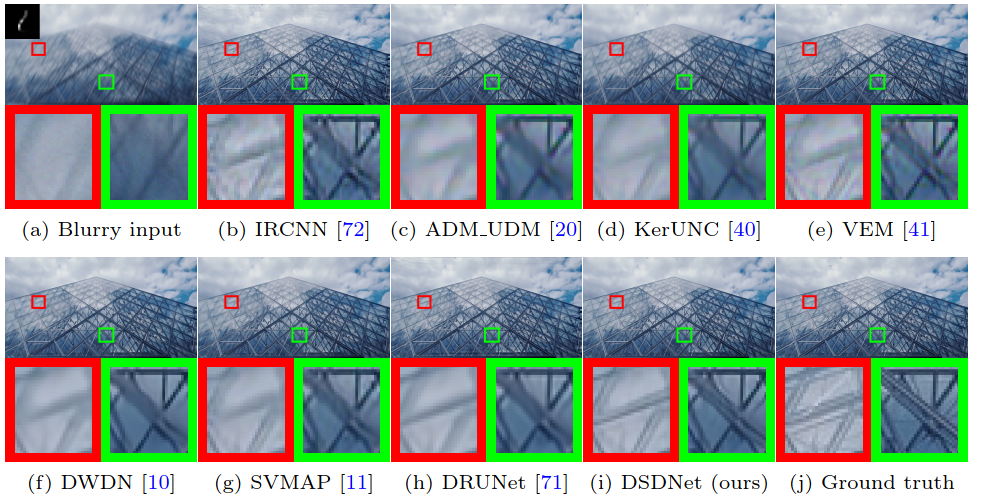
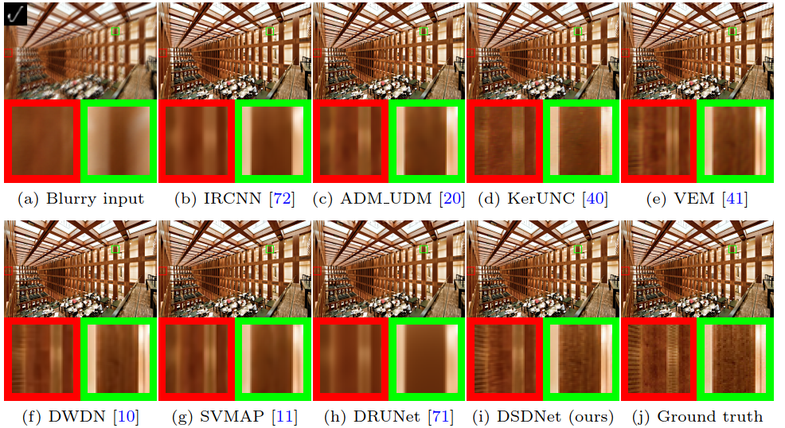

# [ECCV 2022] Learning Discriminative Shrinkage Deep Networks for Image Deconvolution


[**Pin-Hung Kuo**](https://setsunil.github.io/), [Jinshan Pan](https://jspan.github.io/), [Shao-Yi Chien](https://www.ee.ntu.edu.tw/profile1.php?teacher_id=943013&p=3), and [Ming-Hsuan Yang](https://faculty.ucmerced.edu/mhyang/)  


[[Paper](https://arxiv.org/pdf/2111.13876.pdf)]

Abstract
----------
Most existing methods usually formulate the non-blind deconvolution problem into a maximum-a-posteriori framework and address it by manually designing a variety of regularization terms and data terms of the latent clear images. However, explicitly designing these two terms is quite challenging and usually leads to complex optimization problems which are difficult to solve. This paper proposes an effective non-blind deconvolution approach by learning discriminative shrinkage functions to model these terms implicitly. Most existing methods use deep convolutional neural networks (CNNs) or radial basis functions to learn the regularization term simply. In contrast, we formulate both the data term and regularization term and split the deconvolution model into data-related and regularization-related sub-problems according to the alternating direction method of multipliers. We explore the properties of the Maxout function and develop a deep CNN model with Maxout layers to learn discriminative shrinkage functions, which directly approximates the solutions of these two sub-problems. Moreover, the fast-Fourier-transform-based image restoration usually leads to ringing artifacts. At the same time, the conjugate-gradient-based approach is time-consuming; we develop the Conjugate Gradient Network to restore the latent clear images effectively and efficiently. Experimental results show that the proposed method performs favorably against the state-of-the-art in terms of efficiency and accuracy.


Results
----------
* BSD100
 

* Lai
 

Datasets
----------
[Google Drive](https://drive.google.com/file/d/1xfDQ0OUmw8T5kralu-AhQ-eqPNZquUhc/view?usp=sharing)


Models
----------
[Google Drive](https://drive.google.com/file/d/1FHynxgJSXtTCQQVVSMcafwesNekSRrcG/view?usp=sharing)


Dependencies
----------
- Python >= 3.8  
- [PyTorch >= 1.8.1](https://pytorch.org)
```
pip install -r requirements.txt
```

Reproduce the Results
----------
```
sh run_scripts.sh
```


Citation
----------
```BibTex
 @article{kuo2021dsdnet,
  author    = {Kuo, Pin-Hung and Pan, Jinshan and Chien, Shao-Yi and Yang, Ming-Hsuan},
  title     = {Learning Discriminative Shrinkage Deep Networks for Image Deconvolution},
  url       = {https://arxiv.org/abs/2111.13876},
  eprinttype = {arXiv},
  eprint    = {2111.13876},
}
```


## Note
- This code is built upon the implementation from [MMSR](https://github.com/andreas128/mmsr).
